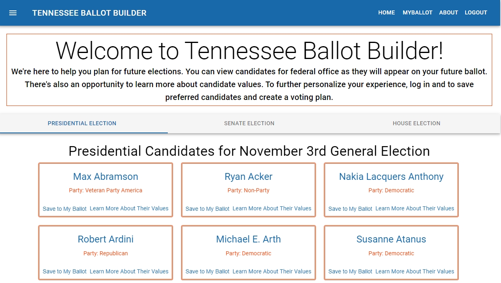
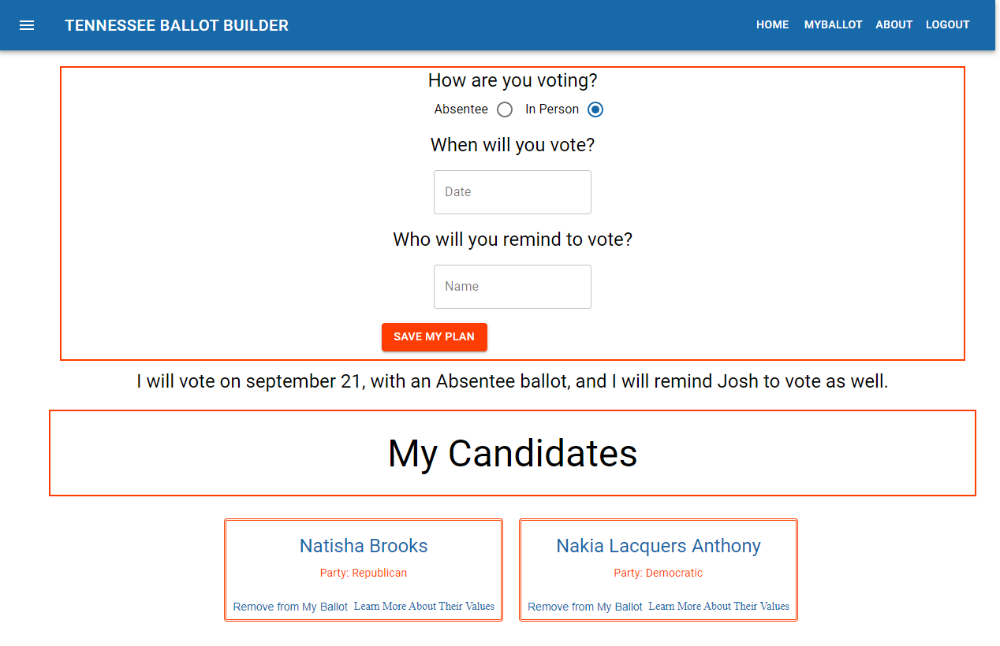
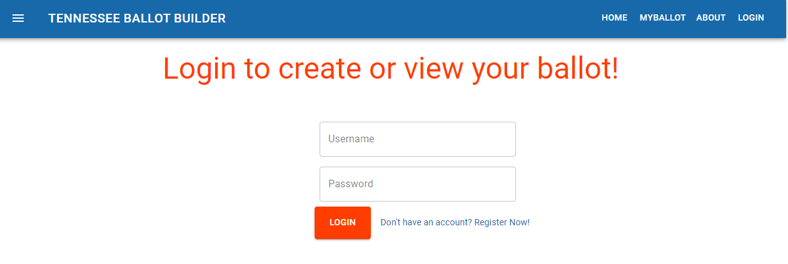
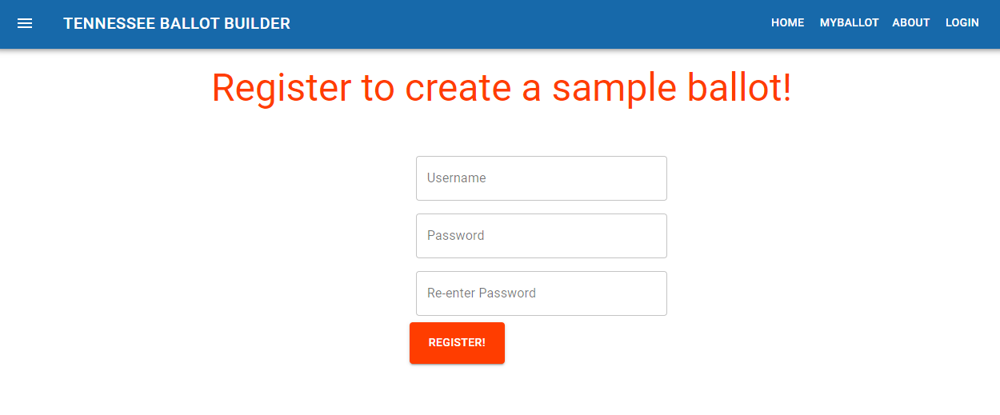

<h1 align= "center">Tennessee Ballot Builder</h1> 
<h2>Live Link</h2>
<h3>https://ballotbuilder.herokuapp.com/</h3>  

<h2> Table of Contents </h2>
<li><a href="#description">Description</a></li>  
<li><a href="#usage">Usage</a></li> 
<li><a href="#tech">Technology Stack</a></li> 
<li><a href="#screen">ScreenShots</a></li> 
<li><a href="#test">Test</a></li>
<li><a href="#contributors">Contributors / Contact</a></li>

<h2 id="description"> Description </h2>

Tennessee Ballot Builder is an application for new or seasoned voters to organize their voting plans. A user can browse candidates for federal office, or they can create an account to save candidates to their ballot, and create a voting plan. This app utilizes passport jwt-strategy for user authentication, as well as axios to obtain candidate data. 

<h2 id="usage"> Usage </h2>

Finding and saving candidates of interest and voting plans to a user's 'ballot'.
 

<h2 id="tech"> Technology Stack </h2>          
<ul>
<li>React</li>
<li>Node</li>
<li>Express</li>
<li>MongoDB</li>
<li>JavaScript</li>
<li>Mongoose</li>
<li>Material-UI</li>
<li>Passport (jwt-strategy)</li>
<li>@hapi/joi</li>
<li>Heroku</li>
<li>Git</li>
</ul>          

<h2 id="screen"> ScreenShots </h2>
<h4> Desktop </h4>

<h2 id="test"> Test </h2>

<h2 id="contributors"> Contributors/ Contact</h2>

<h4><a href= "https://github.com/jeverett93">@jeverett93</a></h4>

<h5><a href= "https://jeverett93.github.io/">Portfolio</a></h5>  
<h5><a href= "mailto:josheverett93@gmail.com">josheverett93@gmail.com</a></h5>       
<h5><a href= "https://www.linkedin.com/in/joshua-everett-087a4649/">LinkedIn</a></h5>

<h4><a href= "https://github.com/sammiefrog">@sammiefrog</a></h4>

<h5><a href= "https://sammiefrog.github.io/">Portfolio</a></h5>  
<h5><a href= "mailto:ssasenick412@gmail.com">ssasenick412@gmail.com</a></h5>       
<h5><a href= "https://www.linkedin.com/in/sammantha-sasenick412/">LinkedIn</a></h5>

